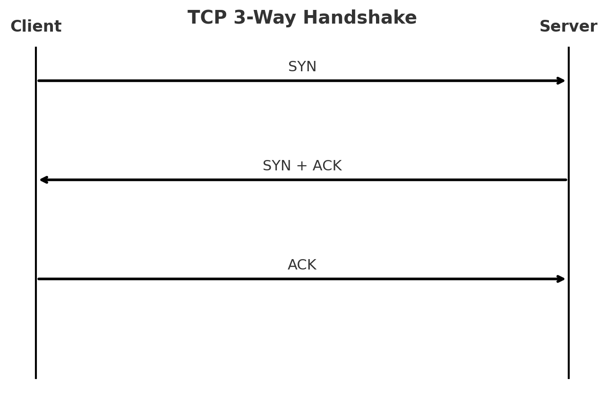

# Raspberrypi-webserver

## TCP 3-Way Handshake

When two machines want to talk over TCP, they need to establish a reliable, ordered, stream-oriented connection. That's done with 3 way handshake.

    1. SYN (Synchronize)
        - The client sends a TCP segment with the SYN flag set to the server.
        - I want to start a conversation. Here's my initial sequence number _(ISN)_.

    2. SYN-ACK (Synchronize + Acknowledge)
        - The server replies with the packet that has both SYN and ACK flags.
        - I got your request, I acknowledge your _ISN_, and here's my own _ISN_.

    3. ACK (Acknowledge)
        - The client sends back a final ACK, confirming it received the server's ISN.
        - The connection is established.
        - Now both sides know each other's sequence numbers and start reliable data transfer.

    
